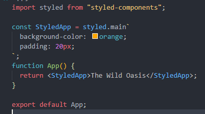
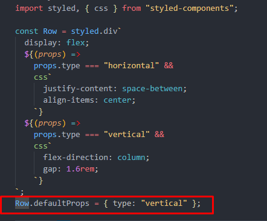
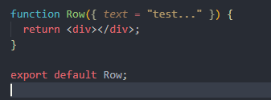

#  `REACT`

Merhaba! Bu depo, React öğrenme serüvenimde oluşturduğum projeleri ve edindiğim bilgileri içeriyor. Şu anki çalışmalarım ve birikimlerim burada bulunuyor ancak bu serüveni daha da zenginleştirmek ve geliştirmek istiyorum. Projelerimi Visual Studio Code (VS Code) geliştirme ortamında hazırlıyorum. İlerleyen günlerde, yeni projeler ekleyecek, öğrendikçe notlar alacak ve bu serüveni daha da güçlendireceğim.

# React ın kurulumu ile başlayalım:
Öncelikle React projesi oluşturmak veya geliştirmek için Node.js'in yüklü olması gerekmektedir. 
"Vite" ve "Create React App" (CRA) arasında tercih yaparken, projenizin ihtiyaçlarına bağlı olarak karar vermelisiniz.
Projelerinizin ihtiyaçlarına ve öğrenme hedefinize bağlı olarak tercih yapabilirsiniz. Ben öğrenmek amaçlı "Creat React App" ı tercih ederken, gerçek hayat projelerinde "Vite" ı kullanacağım.

## <a href="https://create-react-app.dev/">`Create-react-app`</a>

"Create React App" olgun ve geniş bir topluluğa ve daha geleneksel bir yapıya sahiptir. 
* `create-react-app@latest project_name` komutu ile projemizi oluşturabiliriz.
* Projeyi başlatır: npm start 

## <a href="https://vitejs.dev/">`Vite`</a>
"Vite" hızlı geliştirme ve performans avantajları sunar, create react app e göre daha yenidir.
* `npm create vite@latest` ile proje oluşturabiliriz.
* Projeyi başlatır: npm run dev
  
## Create react app ve vite ile oluşturduğumuz proje dosyaları:
| create-react-app | vite |
|----------|----------|
| index.js | main.jsx |
| App.js   | App.jsx  |

*React developer tools: Bir geliştirme aracıdır. Chrome a eklenti olarak ekleyerek component tree, states ve birçok durumu kontrol edebilmenizi sağlar.*

## JSX Nedir ve Nasıl Kullanılır:
* Ekranda göstermek istenilenler için kullanırız. HTML benzeri bir yapıdır. Javascript ve XML in birleşimidir. 
* Jsx i kullanışlı olduğu için ve bileşen oluşturmayı kolaylaştırdığı için kullanıyoruz. Tarayıcı jsx i anlayamadığı için Babel aracılığıyla js e dönüştürülür. Webpack, tüm farklı dosyaları alır ve 
tek yerde birleştirir.
* Tüm prop isimleri camelCase olmalıdır.
* Number lar {} içerisinde verilmelidir.
* Boolean proplarda doğru olduğunu ekstra belirtmeye gerek yok. False da ise {} içerisinde belirtmeliyiz.
* Class yerine className kullanılır .
* Satır içi style obje olarak kullanılır.

## RENDERLAMA:
* Componentler, kullanıcı arayüzünün farklı parçalarını temsil eder.
* Kondisyonel renderlama, bir DOM elementini veya bir componenti koşula bağlı olarak gösterir ya da gizleyebilir.
* Birden fazla component renderlamak istediğimizde döngülerden faydalanabiliriz. Map() methodu en sık kullanılanlardandır. Şayet map() methodu ile renderlama yaparsak o bileşene `key` özelliği vermeliyiz.
* Key özelliği sayesinde yeri ve içeriği değişmeyen elemanların yeniden renderlanmasını engeller ve performansı arttırırız.
* React fragment, Dom'a ekstra düğüm eklemeden bir alt elemanlar listesini gruplandırmamıza olanak tanır, kullanımı <></> ya da <React.Fragment></React.Fragment> şeklindedir.
* Component composition, parent elementten child elemente birden fazla yerden prop geçirerek erişim karmaşasını ortadan kaldırmak adına çok kullanışlı bir yöntemdir. Aynı zamanda parent element yeniden kullanılabilir bir yapıya sahip olur. Child componentleri, parent componentin açılış ve kapanış tagleri içine taşırız ve children propu vererek işlemi tamamlarız. Prop drilling durumundan da böylece kaçınmış oluruz.

# Hooks:
* Functional components lere state ve diğer React özelliklerini eklemek için kullanılan fonksiyonlardır.
* Hookları kondisyon içine koymamalı ve erken return yapmamalıyız.
  
## useState: 
* Değişkenleri değiştirmek için kullanılır. `const [open, setOpen]=useState(false)`

## useEffect:
* React fonksiyonel componentlerinde yan etkileri (side effects) yönetmek için kullanılan bir Hook'tur. Componentin her render işlemi sonrasında çalışır. Bu, bir componentin mount (oluşturulma), update (güncelleme), ve unmount (kaldırma) durumlarına tepki verebileceği anlamına gelir. `useEffect(function(){},[])`
 * 3 farklı bağımlılık dizisi türü vardır:
  * useEffect(fn,[x,y,z]); update te çalışır.
  * useEffect(fn,[ ]); sadece mount ta çalışır.
  * useEffect(fn); Component her yeniden renderlandığında çalışır.

## useRef:
 * Renderlar arasında korunmasını istediğimiz her veriyi içine koyabileceğimiz kutu olarak düşünebiliriz.
 * Değeri değişse bile componenti yeniden renderlamaz.
 * DOM öğelerini seçmek ve saklamak için kullanılır!
 * Refler sadece event handlers da ve effectlerde görünür.( jsx te değil)
 * State gibi renderlarda kalıcıdır (değerleri hatırlar).
 * State te güncelleme (async) bileşenin yeniden oluşturulmasına neden olur ama ref (sync) te olmaz.
   
## useReducer:
 * Aynı anda birden fazla state güncellemek istediğimizde kullanırız.
 * State güncellemesini dispatch ile tetikleriz.
   
## Router:
* Bir Single Page Application (SPA) içinde sayfa değişikliklerini yönetmek için kullanılan bir kütüphanedir. 
* Router ile farklı URL leri farklı UI görünümleriyle (componentleri) eşleştiririz. Böylece, kullanıcıların tarayıcı URL sini kullanarak farklı uygulama ekranları arasında gezinmesine olanak tanır.
* Tek sayfalı uygulamalar oluşturmamızı sağlar.
* Sayfa içeriği değişirken, React DOM, Virtual DOM üzerinden etkili bir şekilde gerçek DOM'u günceller. Bu, kullanıcıya daha hızlı bir kullanıcı deneyimi sunar, çünkü sadece değişen kısımların güncellenmesi gerekir.
* Kullanıcı arayüzünü geçerli tarayıcı URL siyle senkronize tutar.
* Web API'lerinden veri almak ve bu veriyi kullanarak sayfa içeriğini güncellemek de mümkündür.
* `npm i react-router-dom` ile kurulum yapılır.
  ### Single Page Application (SPA):
  * Web uygulamalarının geleneksel çok sayfalı yapı yerine tek bir HTML sayfasında yüklenen ve dinamik olarak içeriği değiştiren; istemcide yani kullanıcının web tarayıcısında tamamen yürütülen bir tür web uygulama mimarisini ifade eder.
  * SPA'lar, sayfalar arasında geçiş yaparken tarayıcıda tam bir sayfa yeniden yüklemesi yapmazlar. Bunun yerine, React router gibi yönlendirme kütüphaneleri kullanılarak tarayıcıdaki URL'yi değiştirmek ve uygun react bileşenlerini göstermek amacıyla sayfa içeriğini dinamik olarak günceller.
  ### Routes:
  * Bir web uygulamasında belirli URL yolları ile ilişkilendirilen sayfaların veya bileşenlerin tanımlandığı bir kavramdır. Bu, genellikle bir web uygulamasının gezinme yapısını yönetmek ve belirli URL'lere karşılık gelen içeriği göstermek için kullanılır. 
  Basitçe Router yapısı (eski versiyon) :  
`<BrowserRouter>` 
   `<Routes>`  
      `<Route path="product" element={<Product />} />` 
   `</Routes>` 
`</BrowserRouter>` 
* React'ta Link bileşeni, kullanıcıların farklı sayfalara gitmelerini sağlamak için kullanılır. to prop'u, kullanıcıyı yönlendirmek istediğiniz sayfanın yolunu belirtir.
* Bu kod, proje başladığında veya URL yolu kontrol paneline (/dashboard) eşit olduğunda kullanıcıyı kontrol paneli (dashboard) bileşenine yönlendirir. Yinelemeleri önlemek ve daha temiz bir yönlendirme yapmak için *Navigate* bileşenini kullanabiliriz.
* `  <Route index element={<Navigate replace to="dashboard" />} />
     <Route path="dashboard" element={<Dashboard />} />`
* ---
### *ROUTER OLUŞTURMANIN YENİ VERSİYONU:*
* App componentimizde createBrowserRouter fonksiyonunu react router dom dan import ettikten sonra route ları oluşturuyoruz.
* Fonksiyonun içinde objeler dizimizde yönlendirmeyi yaparken *path* ile *element* özelliklerini kullanıyoruz.
* Path yolu belirtirken, element de componentimize işaret ediyor.
* İç içe route oluşturmak için children kullanıyoruz. Ve bu child route ları göstermek için `<Outlet/>` componentini import ederek kullanıyoruz.
* RouterProvider a, oluşturduğumuz _createBrowserRouter_ fonksiyonunu prop olarak veriyoruz. 
`const router = createBrowserRouter([` 
  `{` 
   `path: "/",` 
    `element: <Layout />, ` 
    `children: [` 
     `{ path: "home", element: <Home /> },` 
      `{ path: "dashboard", element: <Dashboard /> },` 
    `],` 
  `},` 
  `{ path: "*", element: <NotFound /> },` 
  `]);` 
  `function App() {` 
  `return <RouterProvider router={router} />;` 
  `}` 
  
# Performans Optimizasyonu
 * React uygulamalarının performansını optimize etmek için odaklanacağımız 3 ana dal vardır:
   * Gereksiz renderlamaları engellemek. (Prevent wasted renders):
     * React.memo: Bileşenlerin yalnızca prop’ları değiştiğinde yeniden render edilmesini sağlar.
     * useMemo: Karmaşık hesaplamaların yalnızca bağımlı değerler değiştiğinde çalışmasını sağlar.
     * useCallback: Fonksiyon referanslarını kaydederek, bileşenlerin yeniden render edilmesinde aynı fonksiyonların tekrar tekrar tanımlanmasını engeller.
     * Prop ve Children Kullanımı: Özellikle nesne veya fonksiyon prop larını doğrudan geçirmek yerine useCallback veya useMemo ile sarmalayarak gereksiz renderları azaltabilirsiniz.
   * Genel uygulama hızını arttırmak. (Improve app speed / responsiveness)
     * useMemo ve useCallback: Performans gerektiren işlemleri veya hesaplamaları optimize etmek için kullanılır.
     * useTransition: Kullanıcı deneyimini geliştirmek için geçiş işlemlerini daha pürüzsüz hale getirir, böylece ağır işlemler arka planda yapılırken uygulama yanıt vermeye devam eder.
   * Paket boyutunu azaltmak.(Reduce bundle size)
    * 3. Taraf Kütüphanelerin Kullanımı: Daha hafif ve optimize edilmiş kütüphaneler tercih edilerek paket boyutu küçültülebilir.
    * Code Splitting ve Lazy Loading: Uygulamanın yalnızca ihtiyaç duyulan bölümleri yüklendiğinden başlangıçtaki yükleme süresini azaltır. React.lazy ve Suspense kullanarak bileşenleri 
     tembel yükleme ile yalnızca ihtiyaç duyulduğunda yüklemek bu tekniklerdendir.
        - `import React, { lazy } from "react";` 
          `const About = lazy(() => import("./About"));`
 ---
# REDUX :
 * Bir web uygulamasında global state i yönetmek için kullandığımız 3. taraf kütüphanedir.
 * Uygulamamızdaki tüm global state, global olarak erişilebilen yerde ( globally accessible store) saklanır ve action tetiklendiğinde store güncellenir. Tıpkı useReducer gibi.
 * Global store güncellenir güncellenmez store içerisindeki state bağlı tüm componentlerde yeniden renderlanır. (Context api ile useReducer ı birleştirmeye benzer fakat büyük projelerde verimlilik adına redux kullanmak daha mantıklı olacaktır.).
 * Redux ı kullanmanın 2 yolu var
   * 1- Classic Redux
   * 2- Modern Redux Toolkit
 * Redux ile global state i güncelleme döngüsü:
   * Bir componentte bir action oluşturucuyu (action creator function) çağırarak başlıyoruz.
   * Ardından sonuçlanan action, store a ulaşır yani doğru reducerın, action ı alıp güncelleyeceği yer.
   * Daha sonra bu kullanıcı arayüzünün yeniden tetiklenmesini sağlayacak.
   * Buradaki asıl hedef, durum güncelleme mantığını uygulamanın geri kalanından ayrı kılmak.
 * *npm i redux* ile kurulum yapılır.
 * Tıpkı reducer da oluşturduğumuz gibi initialState objesi oluşturuyoruz.
 * Daha sonra reducer fonksiyonu oluşturup parametrelerini *state* ve *action* olarak veriyoruz. useReducerdan farkı, *state i default olarak initial state* e eşitliyoruz.
 * Switch case yapımızı oluşturup her durumu ele alıyoruz. Default olarak error oluşturmak yerine state i döndürüyoruz.
 * createStore u reduxtan import ediyoruz ve çağırıyoruz, parametre olarak da  reducer fonksiyonunu ekliyoruz. `const state=createStore(reducer)`
 * Daha sonra, store objesinden dispatch fonksiyonumuzu okuyoruz ve useReducerda olduğu gibi güncelliyoruz (her state için manuel olarak).
 * Aslında manuel olarak yapmaktansa, otomatik olarak bu işlevi gerçekleştirmek için *Action Creators* yapısını kullanabiliriz (Yaptığı tek şey actionları geri döndürmek).
 * Oluşturulan birden fazla Reducer fonksiyonunu bir araya getirmek ve kullanmak için bir Root reducer oluşturup, bu değişken üzerinde *combineReducers* fonksiyonunu çağırabiliriz.
   * `const routeReducer = combineReducers({
  account: accountReducer,
  customer: customerReducer,
});
`
* Redux store u react uygulamasıyla bağlamak için öncelikle *npm i react-redux* ı kurmamız gerekiyor.
* React reduxtan *Provider* componentini import edip uygulamamızın tümünü providera saralım, bu işlem context api daki gibi yapılır. Daha sonra oluşturduğumuz *store* yapısını providera prop olarak verelim.
* Redux store dan veri okumak için useSelector() kullanılır. `const customer=useSelector((store)=>store.customer)`.
* React componentlerinin içerisinden redux store una action göndermek için *useDispatch()* kullanılır.
* Bazı api lara asenkron çağrı yaparken reducer ların içerisinde kesinlikle yapamayız. Çünkü reducer ların saf (pure) fonksiyonlar olması gerekir.
* Asenkron bir işlemi component içerisinde yaparak dispatch için kullanabiliriz ama bu da ideal değildir.
* Peki ya store veya componentlerde yapamayacaksak nerede yapacağız? Tam burada devreye *Middleware* giriyor.
* Middleware, action ın gönderilmesi ile  store arasında yer alan bir fonksiyondur
* Gönderdikten (dispatching) sonra güncellenen state, direkt store a gitmek yerine bir ara birime uğrar. Burası *"Redux Thunks"* olarak isimlendirilir ve 3rd party bir pakettir.
* Asenkron tüm işlemler için Thunks kullanalım:
  * 1- `npm i redux-thunk` ile Redux Thunks ı kuralım.
  * 2- Store içerisinde oluşturalım.
  *  `const store = createStore(rootReducer, applyMiddleware(thunk));`
  * 3- Action Creator içerisinde kullanalım.
  # REDUX GELİŞTİRİCİ ARAÇLARI:
    * Chrome eklentisi olarak *redux-devtools* u kuralım.
    * Daha sonra `npm i redux-devtools-extension` ı terminalde yazarak kuralım.
    * Bu paketten {composeWithDevTools} fonksiyonunu store adlı dosyada import edelim.
    * Ve bunu applyMiddleware e saralım. `const store = createStore(
     routeReducer,
     composeWithDevTools(applyMiddleware(thunk))
     );`
  # REDUX TOOLKIT:
    * Redux kodu yazmanın daha modern ve tercih edilen yoludur.
    * Daha az kod yazmamızı sağlar.
    * !!! Reducer içerisinde state'i değiştiren kod yazabiliriz. (Arka planda Immer isimli bir kütüphane tarafından immutable olarak çevirilir).
    * !!! Action Creatorlar otomatik olarak oluşturulur.
    * !!! Otomatik olarak thunk middleware ve devtools setup'u yapılır.
    * `npm i @reduxjs/toolkit` ile kurulum yapalım ve store dosyasında *configureStore* u import edelim.(createStore yerine kullanacağız).
    * configureStore, reducerları otomatik olarak birleştirecek, thunk middleware i otomatik olarak ekleyecek, hatta geliştirici ayarlarını otomatik olarak ayarlayacaktır.

  ---
  # İSTEMCİ (Client) TARAFINDA İŞLEME (CSR) Mİ, (Server) SUNUCU TARAFINDA İŞLEME (SSR) Mİ?

| CSR WITH PLAIN REACT | SSR WITH FRAMEWORK |
|-----------------------|--------------------|
| Tek Sayfalı Uygulamalar (SPA'lar) oluşturmak için kullanılır | Çok Sayfalı Uygulamalar (MPA'lar) oluşturmak için kullanılır |
| Tüm HTML istemcide oluşturulur | Bazı HTML'ler sunucuda oluşturulur |
| Uygulamalar çalışmaya başlamadan tüm js in indirilmesi gerekiyor: Performans açısından kötü (kalitesiz cihaz, kötü internet bağlantısı var ise) | Daha az JavaScript indirilmesi gerektiğinden daha performanslı |
| şirket içi araçlar, dahili uygulamalar veya daha az SEO gereksinimi olan uygulamalar için mükemmel bir seçim olabilir. |  SEO gereksinimlerini ön planda tutan ve içeriğin hızlı bir şekilde kullanıcıya ulaşması gereken uygulamalar için ideal bir yaklaşımdır (örneğin, bloglar veya e-ticaret siteleri).  |

# STYLED COMPONENTS
* React uygulamalarında kullanılan popüler bir CSS-in-JS kütüphanesidir.
* React bileşenlerini oluştururken herhangi bir harici CSS dosyası oluşturmanıza veya sınıflarla uğraşmanıza gerek kalmadan, js dosyaları içerisinde css style tanımlamalarını yapmamızı sağlar.
* Dinamik stiller oluşturmayı ve bileşenler arasında stil iletimini kolaylaştırmayı sağlar. Bu sayede bileşenlerinizin stilini daha modüler ve okunabilir bir şekilde yönetebilirsiniz.
* `npm i styled-components` ile kurulum yapılır.
* `import styled from "styled-components` ile dosyamıza  import ettikten sonra kullanıma geçebiliriz.
  
 
 
* `createGlobalStyle` fonksiyonu, bileşen stillerini merkezi bir yerden oluşturmak ve tekrarı azaltmak için kullanılır. Bu, kodun daha düzenli ve bakımı daha kolay olmasını sağlar.
## Styled Components de Esnek Bileşenler ve Varsayılan Özellikler Kullanımı:
 
 

# SUPABASE
* Geliştiricilerin postgres veritabanıyla kolayca arka uç (backend) oluşturmasına olanak tanıyan hizmet.
* Otomatik olarak bir veritabanı ve API oluşturur, böylece sunucudan kolayca veri isteyip alabiliriz.
* Sadece bir API değildir, supabase ayrıca kullanımı kolay kullanıcı kimlik doğrulama ve dosya depolama özellikleriyle birlikte gelir.
* Supabase, SQL tarafından desteklenen, ilişkisel bir veritabanı olan postgres veritabanını kullanmaktadır. Bu tabloları birleştirmek için foreign key kullanılır.

# REACT QUERY
* Remote state i yönetmek için kullanılan güçlü bir kütüphanedir.
* Çok daha az kod yazmamıza olanak tanırken aynı zamanda kullanıcı deneyimini çok daha iyi hale getiren birçok özelliği mevcuttur:
   * Otomatik yükleme ve hata durumları
   * State i senkronize tutmak için otomatik yeniden getirme 
   * Getirilen tüm remote stateler önbellekte saklanır.
   * Pre-fetching.
   * Kolay bir şekilde uzaktan state değişimi (güncelleme).
   * Çevrimdışı destek.
   * Remote state, regular stateten farklıdır.
   * Asenkron işlemleri, ara yüzümüz ile senkron tutmak için react query kullanıyoruz.
* `npm i @tanstack/react-query` ile kurulum yapalım.
* Kullanımı:
   * İlk önce verilerin barındığı bir yer oluşturalım. 
     `const queryClient = new QueryClient({
  defaultOptions: {
    queries: {
      //Güncellenme süresi
      staleTime: 60 * 1000,
    },
  },
});`
   * İkinci olarak uygulamaya sağlayalım (provide).  
   ` <QueryClientProvider client={queryClient}>
      ... 
    </QueryClientProvider>`
* React query nin geliştirme aracını kurmak için `npm i @tanstack/react-query-devtools` komut satırından faydalanabiliriz. QueryClientProvider ın içerisinde: 
`  <ReactQueryDevtools initialIsOpen={false} />`
* `useQuery hook` u, React Query'nin bir parçasıdır ve sunucudan veri getirmek, bu verileri yönetmek için kullanılır.
* `useMutation hook ` u : Mutasyon, genellikle bir API isteğini tetiklemek ve ardından başarılı veya başarısız olması durumunda belirli işlemleri gerçekleştirmek için kullanılır. Örneğin bir kullanıcının bilgilerini güncellemek, bir öğeyi silmek veya yeni bir öğe eklemek gibi işlemleri yapmak için kullanılabilir. 
   `  const { mutate, isLoading: isCreating } = useMutation({
    mutationFn: createCabin,
    onSuccess: () => {
      toast.success("New cabin successfully created");
      //ui re render
      queryClient.invalidateQueries({ queryKey: ["cabins"] });
      reset();
    },
    onError: (err) => toast.error(err.message),
  });`
  * mutate: Mutasyon işlevini tetiklemek için kullanılır. Bu işlev, mutationFn parametresinde belirtilen mutasyon işlevini çağırır.
  * isLoading: Mutasyon işlemi sırasında yüklenme durumunu takip etmek için kullanılır. Bu değişken, mutasyon işlemi devam ederken true, tamamlandığında ise false değerini alır.
  * mutationFn: Mutasyon işlevini tanımlar. Bu işlev, yeni bir kabin oluşturmak için kullanılacak createCabin fonksiyonunu temsil eder. ( `mutationFn: createCabin`)
  * onSuccess: Mutasyon işlemi başarılı olduğunda gerçekleştirilecek işlemleri tanımlar. Bu durumda, yeni bir kabin başarıyla oluşturulduğunda bir başarı bildirimi görüntülenir, ilgili sorgunun önbelleğini 
   geçersiz kılınır (queryClient.invalidateQueries) ve form sıfırlanır (reset).
  * onError: Mutasyon işlemi başarısız olduğunda gerçekleştirilecek işlemleri tanımlar. Bu durumda, bir hata bildirimi görüntülenir ve hatanın mesajı kullanıcıya iletilir.

#  <a href="https://react-hook-form.com/">REACT HOOK FORM</a>
* Bu kütüphane, form işlemlerini kolaylaştırmak için React uygulamalarında kullanılan bir form yönetim çözümüdür.
* `npm i react-hook-form` ile kurulum yapılır.
* `const { register, handleSubmit } = useForm();` : Buradaki register ve handleSubmit değişkenleri, "react-hook-form" kütüphanesinin sağladığı iki önemli fonksiyonu temsil eder.
  * *register*: Bu fonksiyon, formdaki her bir input alanını yönetmek için kullanılır. Input alanlarını bu fonksiyonla kaydederek, değerlerin doğrulanması, takip edilmesi ve gönderilmesi gibi işlemler gerçekleştirilebilir.
  * *handleSubmit*: Bu fonksiyon, formun gönderilme işlemi için kullanılır. Formun gönderilme olayını yönetir ve gönderme işlemi için belirtilen bir call back işlevini çalıştırır. Bu işlev, formdaki alanlardan toplanan verileri işlemek ve gerekli işlemleri gerçekleştirmek için kullanılabilir.
  * Bu iki fonksiyonun yanı sıra farklı fonksiyonları da içerir.<a href="https://react-hook-form.com/docs/useform"> Daha fazla detay için ... </a>
  * `<Textarea
          type="number"
          id="description"
          defaultValue=""
          {...register("description")}
        />` registerı inputları yönetmek için bu şekilde dağıtırız.
  * *getValues()*: Form değerlerini okumak için optimize edilmiş bir yardımcıdır.
  * Örnek bir kod satırı: 
  `<Input
          type="number"
          id="discount"
          defaultValue={0}
          {...register("discount", {
            required: "This field is required",
            validate: (value) =>
              value <= getValues().regularPrice ||
              "Discount should be less than regular price",
          })}
        />`
# React ta yeniden kod kullanılabilirliği için yöntemler:
  ## Kullanıcı Arayüzü (UI)    
    * Componentler ve proplar
    * Children prop  
  ## Durum Bilgili Mantık (Stateful Logic)    
    * Custom Hooks
  ### Her iki kategori için ise :
    * Render props pattern : Render Props deseni, bir componentin içindeki işlevselliği dışa aktarmanın ve bu işlevselliğin diğer
    componentler tarafından kullanılmasını sağlamanın bir yoludur. Bu, React uygulamalarında componentler arasında esneklik ve
    yeniden kullanılabilirlik sağlar. Hook lardan önce daha yaygın ve kullanışlıydı.
    * Compound component pattern : Kendi state lerini yönetmek isteyen birbirleriyle ilişkili componentlerin bir araya gelerek 
    daha büyük ve karmaşık componentlerin oluşturulmasını sağlayan bir tasarım desenidir. Compound componentler, modüler ve yeniden kullanılabilir kullanıcı arayüzü componentlerinin geliştirilmesinde yardımcı olur.

